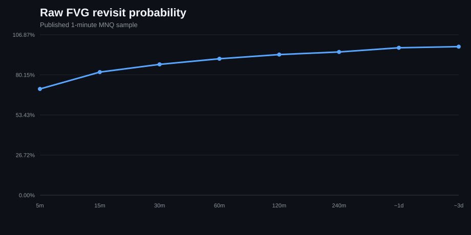
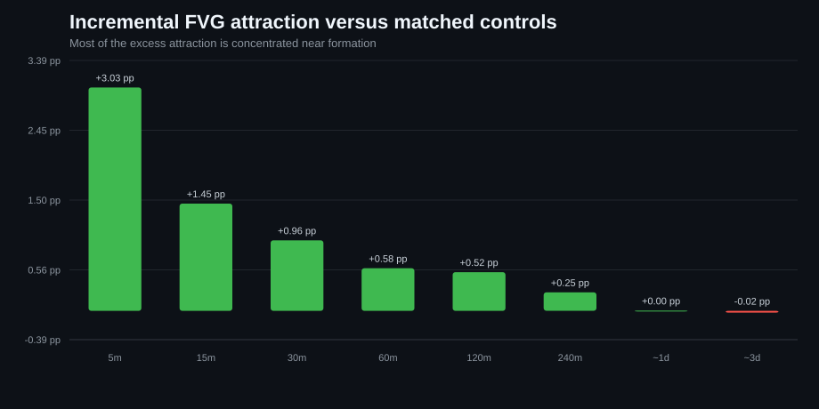
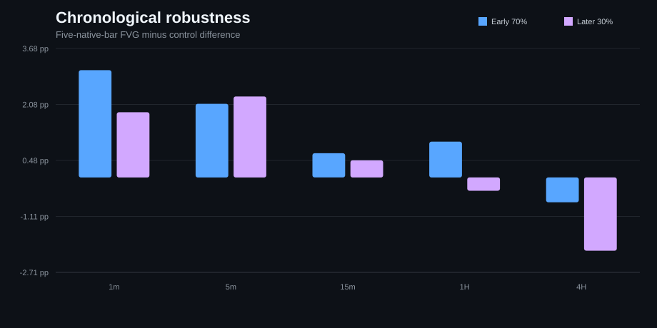

# Fair Value Gaps — Predictive Strength

**Two research tracks:** frozen CME MNQ evidence (2020–2026) + a reproducible public Nasdaq-100 proxy replication (2010–2026, 5M+ one-minute bars).

> **Research question:** after controlling for distance, volatility, trend, session and ordinary price revisits, does the **FVG label itself** add useful predictive information?

**Published conclusion:** FVGs were revisited frequently, but most of the apparent “magnetism” was shared by comparable ordinary zones. The remaining effect was small, strongest shortly after formation, and inconsistent across longer horizons, timeframes and later data.

## Two-track design

The repository now deliberately separates two evidence tracks:

| Track | Data | Purpose |
|---|---|---|
| **Published MNQ study** | CME MNQ, 2020–2026, licensed history | Frozen futures-specific reference evidence |
| **Public Nasdaq replication** | HistData NSX/USD, late-2010–2026, 5M+ 1m rows | Longer-history replication, live inspection, discovery and robustness |

The public track can be prepared from the free HistData download, explored candle-by-candle in the Research Lab, rerun experiment-by-experiment, or reproduced end-to-end with the same nine reader-facing hypothesis families. It never overwrites the frozen MNQ outputs. A GitHub Release installer is implemented as an optional distribution route, but the repository does not assume redistribution rights for third-party market data.

> **Important:** NSX/USD is an index-style quote feed, not CME NQ/MNQ futures. The public replication is appropriate for price-pattern robustness, not futures volume, contract-roll, exact-tick, slippage or execution claims.

## Start here

| Goal | Best path |
|---|---|
| Understand the study without installing anything | **[Open the static research report](https://t8pium.github.io/fvg-predictive-strength/)** |
| Understand the terminology and interpretation | [Reading guide](docs/READING_GUIDE.md) |
| See exact experiment definitions | [Experiment specification](docs/EXPERIMENTS.md) |
| Read the scientific limitations | [Scientific audit](docs/SCIENTIFIC_AUDIT.md) |
| Understand the app/demo/reproduction tools | [Research Platform Guide](docs/PLATFORM_GUIDE.md) |
| Reproduce the study locally | Download ZIP → extract → double-click **START_HERE.bat** |
| Read the complete project-chat research archive | [Full research & platform archive](docs/CHAT_RESEARCH_ARCHIVE_2026-09-20.md) |
| Read the temporal attraction/rejection extension | [Temporal attraction & reaction study](docs/TEMPORAL_ATTRACTION_REACTION_STUDY.md) |
| Reproduce everything on free long-history Nasdaq data | **[Public Nasdaq research track](docs/PUBLIC_NASDAQ_RESEARCH.md)** |

## Study at a glance

| Question | Published result |
|---|---|
| Do 1m FVGs get revisited often? | **90.86%** touched within 60 minutes; **99.88%** eventually touched in-sample. |
| Are they much more attractive than matched ordinary zones? | Deep 1m excess: **+3.03 pp at 5m**, **+0.58 pp at 60m**, approximately **0 pp by ~1 day**. |
| Does the effect survive as the gap gets older? | The incremental 1m advantage decayed rapidly after the first few bars. |
| Does FVG formation predict directional continuation? | Five-bar continuation differences were small and mixed across timeframes. |
| Is exact midpoint / CE behavior stable? | Results varied by timeframe; the larger 4H cell is exploratory rather than independently confirmed. |
| Does the effect survive later data? | Several later-sample effects weakened or became negative. |

## New temporal attraction / rejection extension

A newer exploratory study on the **same MNQ history** asks when FVGs have the most incremental value as attraction zones and as reaction/rejection zones.

Headline matched results:

| Outcome | FVG | Matched ordinary zone | Excess |
|---|---:|---:|---:|
| 60m near-edge attraction | **90.98%** | 89.93% | **+1.05 pp** |
| First-touch rejection | **52.66%** | 50.93% | **+1.93 pp** |
| 3-bar move away after touch | **+0.020 ATR** | -0.007 ATR | **+0.032 ATR** |

The main finding is that **attraction is more regime-dependent**, while **reaction/rejection is smaller but more temporally stable**. FVG age and native chart timeframe are stronger conditioning variables than recurring weekday or calendar-month seasonality.

This extension is deliberately separated from the frozen published v1 metrics. Read the full methodology, year/session/hour breakdowns and caveats in [docs/TEMPORAL_ATTRACTION_REACTION_STUDY.md](docs/TEMPORAL_ATTRACTION_REACTION_STUDY.md).

## Research architecture

The nine reader-facing experiments share four heavy computational suites.

~~~mermaid
flowchart LR
    A[Licensed Databento / OHLCV] --> B[Active MNQ 1m series]
    B --> C[Mechanical FVG detection]
    C --> D[Detailed 1m suite]
    C --> E[Multi-timeframe suite]
    C --> F[Midpoint / CE suite]
    C --> G[CE body / execution suite]
    D --> H[01 Raw Fill]
    D --> I[02 Matched Attraction]
    D --> J[08 Controls & Regimes]
    D --> K[09 Chronological Robustness]
    E --> I
    E --> L[03 Age Decay]
    E --> M[04 Continuation]
    E --> N[05 First-Touch Reaction]
    E --> K
    F --> O[06 Midpoint / CE]
    G --> P[07 Body Acceptance]
~~~

The presentation layer does **not** reimplement the canonical calculations.

## Research Lab

The local app is evidence-first. All frozen published results can be explored with **no market data**.

Each experiment page contains a conceptual visual, headline metrics, charts, exact values, method, limitation, a provenance panel, reproduction controls and the hash-locked canonical source.

### First launch vs later launches

The first run of **START_HERE.bat** creates the private **.fvg_venv** and installs the pinned dependencies.

Later launches are intentionally fast:

1. fingerprint dependency definitions;
2. perform one lightweight environment health probe;
3. **skip all pip installation commands** if the environment is healthy;
4. launch the Research Lab.

A regression test protects this fast path.

## 60-second quick demo

No licensed data required.

~~~bash
python scripts/run_demo.py
~~~

Or open **Quick demo** in the Research Lab.

The demo exercises:

~~~text
synthetic OHLCV
  → causal market state
  → FVG detection
  → matched ordinary controls
  → forward touch outcomes
  → result table/chart
~~~

**The synthetic demo proves the software workflow, not a market effect.**

## Full one-click reproduction

Prepare licensed data, then click **Full reproduction → Start / resume full reproduction**.

~~~bash
python scripts/reproduce_full.py
~~~

The orchestrator runs 12 cached stages: detailed 1m; multi-timeframe at 1m, 5m, 15m, 1H and 4H; midpoint at the same five timeframes; and the full CE/body execution suite.

Every stage is linked to the active dataset timestamp. If the process is interrupted, launching it again skips fresh successful stages and resumes the unfinished work.

Use **--force** only when you intentionally want to recompute everything.

## Data preparation

The recommended Windows path is the native **Choose market-data file(s)…** button. It passes the real local file path and avoids copying large archives through the browser.

Supported inputs include DBN, compressed DBN, Parquet, CSV variants, ZIP archives, multiple files and directories.

The importer:

1. resolves Databento symbols;
2. keeps strict quarterly MNQ outrights;
3. assigns CME trade date at 18:00 America/New_York;
4. selects the highest-total-volume contract by trade date;
5. deduplicates exact overlap and rejects conflicting duplicates;
6. validates OHLC;
7. writes a new versioned dataset generation;
8. atomically switches the tiny **current_dataset.json** pointer.

Large data files are therefore **not overwritten in place**, avoiding the Windows lock problem that existed in the earlier build.

Published snapshot:

~~~text
active rows:          2,303,483
contracts:            27
duplicate timestamps: 0
missing OHLC:          0
start:                 2020-01-01 23:00:00+00:00
end:                   2026-07-10 20:59:00+00:00
~~~

### Public long-history Nasdaq replication

The HistData NSX/USD workflow is now a first-class second research track instead of only an external-data adapter.

Prepare the merged CSV directly:

~~~bash
python scripts/prepare_histdata_nsx.py \
  --input "C:\\path\\to\\NSXUSD_M1_ALL.csv" \
  --output data/public/nsxusd
~~~

If a public dataset Release asset is ever published **after redistribution permission is confirmed**, it can instead be installed with:

~~~bash
python scripts/install_public_nsx.py
~~~

Until then, the supported public route is to download the free source from HistData and prepare the merged CSV locally.

Then reproduce the complete experiment family:

~~~bash
python scripts/reproduce_public_nsx.py
~~~

The Research Lab adds dedicated pages for:

- public dataset setup and audit;
- date-range candle browsing with live FVG overlays;
- individual public experiment reruns;
- resume-safe full public reproduction;
- machine-readable public result summaries.

All outputs stay under `results/public_nsx/`. The original MNQ evidence remains frozen.

To build the distributable data asset from the merged CSV:

~~~bash
python scripts/package_public_nsx.py --input "C:\\path\\to\\NSXUSD_M1_ALL.csv"
~~~

The roughly 365 MB merged CSV is intentionally **not committed to Git history**. The repository contains tooling to build a Release asset, but do not publish or redistribute HistData-derived market files unless the applicable data terms or explicit permission allow it. See [Public Nasdaq research track](docs/PUBLIC_NASDAQ_RESEARCH.md).

## Static research report / downloadable artifact

The public report is generated from repository evidence rather than maintained separately by hand:

~~~bash
python scripts/generate_static_report.py --output site/index.html
~~~

It includes the study summary, architecture, all nine experiments, frozen metrics, visual explainers, exact method sequence, provenance and scientific limitations.

The **Report / export** page also lets a local user download the complete report as one self-contained HTML file.

## Diagnostics

The Research Lab **Diagnostics & uncertainty** page exposes matched effect size across horizon, raw fill-rate sample size, descriptive Wilson intervals, CE sample-size uncertainty and chronological early-vs-later shifts.

Descriptive intervals are explicitly labeled and **do not pretend overlapping market events are independent**. Canonical clustered/bootstrap inference remains separate.

## Machine-specific performance

Instead of publishing timing numbers from one computer, the app benchmarks the machine it is actually running on.

~~~bash
python scripts/benchmark.py
python scripts/benchmark.py --include-dataset
~~~

The benchmark can measure fresh dependency import, quick-demo runtime and Python peak allocation, report generation, optional active-dataset loading and real stage times from a completed full reproduction.

## Canonical-source integrity

Published analysis remains under **src/original/**.

Before a canonical run, **scripts/run_original.py** checks the declared SHA-256 hash, resolves the active dataset generation, rewrites only known historical machine paths in a temporary AST copy, executes that temporary copy, and records the generated files and run manifest.

Provenance and source hashes also live in [reference_results/manifest.json](reference_results/manifest.json).

## Research v2 — corrected / extended study

The published v1 code is preserved for reproducibility. Known scientific limitations are **not silently patched inside it**.

Instead, [research_v2/](research_v2/) implements a separate new-research track with symmetric full-horizon eligibility, active-contract-boundary censoring, parent-paired age-decay controls, CME trade-date bootstrap clustering, test-period-local matched controls, walk-forward validation and Benjamini-Hochberg FDR correction.

Current runnable studies:

~~~bash
python -m research_v2.runner attraction-1m --horizon 60
python -m research_v2.runner age-decay-1m
python -m research_v2.runner walk-forward-1m --horizon 60
python -m research_v2.runner ce-reinfer --bootstrap 500
~~~

The CE re-inference command reuses the canonical trade rows but clusters uncertainty by CME trade date and applies Benjamini-Hochberg FDR correction across the tested timeframe/depth cells. Every v2 result is labeled **NEW / UNPUBLISHED RESEARCH** until it has been run on licensed history and reviewed.

## Research Platform v4 — audit layer

Version **4.0.0** adds the next layer of scientific scrutiny around the preserved v1 study and corrected v2 methods.

### Event-level visual audit

Open **Event explorer** to browse real FVG observations on candlestick charts. Filter by year, direction, session, geometry and touch outcome. Exact volatility-regime/trend filters are optional because reproducing the rolling causal state across millions of bars is computationally heavier.

Matched ordinary controls are generated on demand so ordinary browsing stays fast.

### Placebos and ablations

Run:

~~~bash
python -m research_v2.runner placebo-1m --horizon 60 --max-events 3000
python -m research_v2.runner ablation-1m --horizon 60 --max-events 3000
~~~

The placebo suite deliberately breaks the FVG label using state-matched ordinary zones, shuffled event geometry, mirrored direction and time-shifted geometry.

The ablation suite removes matching components one at a time to show how session, time-of-day, volatility and trend assumptions affect the measured difference.

### Power / minimum detectable effect

The **Power / MDE** page estimates detectable probability differences under explicit sample sizes, baseline probabilities and design-effect penalties for clustering/dependence. It also provides a mean-R detectable-effect calculator for smaller trade-like samples.

### Hypothesis registry

Research v2 includes an append-only JSON preregistration format with SHA-256 locking.

~~~bash
python scripts/register_hypothesis.py my_draft_hypothesis.json
~~~

A committed example lives at `research_v2/hypotheses/H001-EXAMPLE.json`.

### Golden regression dataset

`tests/fixtures/golden_ohlcv.csv` is a permanent synthetic mini dataset with expected detector output and a byte-stable Git blob hash. CI checks both the file identity and the exact expected FVG count.

### Standard run provenance

Canonical runs, corrected v2 runs and full reproductions write machine-readable capsules under:

~~~text
results/_run_records/
~~~

Each capsule records the command, git commit when available, dependency fingerprint, Python/OS, elapsed time, dataset pointer hash, input/output SHA-256 hashes and run-specific metadata.

### Dataset preflight

Before building the active series:

~~~bash
python scripts/preflight.py YOUR_DATA.zip
~~~

The preflight reports file/archive structure, compression size, supported members, tabular schema and—where DBN metadata or symbology sidecars expose it—MNQ contract/date hints.

### Stability atlas

The **Stability atlas** makes timeframe, chronology and distance effects visible together. Local reproduction unlocks additional timeframe × horizon, year, volatility and sensitivity tables when those canonical outputs exist.

### Economic significance

The **Economic significance** page applies explicit MNQ commission and round-turn slippage assumptions to the canonical CE trade-level outputs. Non-trade attraction probabilities are deliberately not converted into PnL without an explicit trading rule.

### Published v1 vs corrected v2

The **v1 vs v2** page is populated only from locally generated corrected research. It shows the historical published estimate, corrected estimate, change and the methodological reason for the revision.

### GitHub Releases

The repository now has release automation and versioned packaging. A release build creates:

- a clean project ZIP with no local data/results/environment;
- a self-contained HTML research report;
- `SHA256SUMS.json`;
- a GitHub Release with generated notes.

Build locally:

~~~bash
python scripts/build_release.py
~~~

Or run the **Build GitHub release** workflow manually with a version, or push a `v*` tag.

## Repository map

~~~text
app/                          Streamlit Research Lab presentation layer
fvg_research/                 reusable detector/data/demo/report/diagnostic code
research_v2/                  corrected / extended unpublished research
scripts/                      preparation, canonical runner, demo, full-run, benchmark, report
src/original/                 hash-locked published analysis scripts
reference_results/            frozen metrics, figures and provenance
docs/                         reading guide, experiment spec, audit, platform guide
results/                      ignored local outputs
data/                         ignored licensed data generations
START_HERE.bat                one-click Windows launcher
bootstrap.py                  fast isolated environment/bootstrap logic
dashboard.py                  thin Streamlit entry point
~~~

## Verification

~~~bash
python -m pip check
python -m compileall -q .
python -m unittest discover -s tests -v
python scripts/ci_policy_check.py
python scripts/generate_static_report.py --output site/index.html
~~~

CI verifies supported Python versions on Linux and Windows, package portability, every dashboard route, detector/no-lookahead mechanics, IO/DBN handling, dataset switching, the quick demo, Research v2 correction mechanics, static-report generation, canonical hashes and licensed-data exclusion.

## Important scientific limits

The current published v1 study retains documented issues including long-horizon right-censor asymmetry in one detailed 1m comparison, chronological robustness that is not a sealed prospective holdout, survivor-zone weighting in the published age-decay control calculation, calendar-date rather than CME-trade-date clustering in some v1 bootstraps, some non-CE outcomes that can span an active-contract roll, and overlapping observations/multiple-testing risk in exploratory CE analysis.

Read the [Scientific Audit](docs/SCIENTIFIC_AUDIT.md) before treating any positive result as an independent trading edge.

---

**Published report:** https://t8pium.github.io/projects/fvg-predictive-strength/  
**Generated static report:** https://t8pium.github.io/fvg-predictive-strength/
