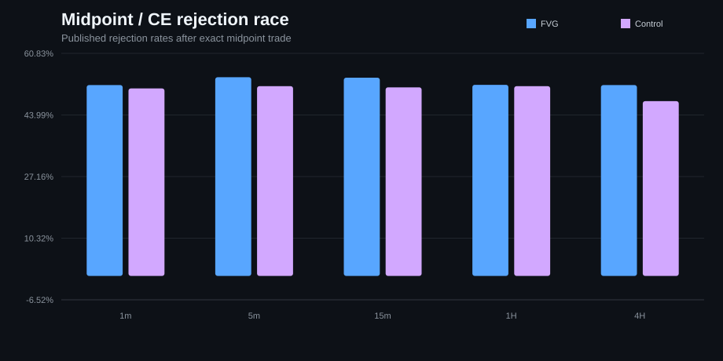

# Fair Value Gaps — Predictive Strength (MNQ)

**2,303,483 active 1-minute bars · 454,197 detected 1m FVGs · 27 MNQ contracts · 2020–2026 · 9 experiments**

This repository tests a narrower question than most Fair Value Gap discussions:

> **After controlling for distance, volatility, trend, session and ordinary price revisits, does the FVG label itself add useful predictive information?**

The published answer is deliberately modest: **FVGs were revisited frequently, but most of the apparent “magnetism” was not unique to FVGs. The remaining effect was small, strongest shortly after formation, and inconsistent across longer horizons, timeframes and later data.**

The project is built for two separate jobs:

1. **Inspect the completed research immediately** — no Databento account or local market data required.
2. **Reproduce the calculations independently** — using your own licensed data and the preserved canonical scripts.

## Study at a glance

| Question | Published result |
|---|---|
| Do 1m FVGs get revisited often? | Yes. About **90.86%** touched within 60 minutes and **99.88%** eventually touched in the available sample. |
| Are they much more attractive than comparable ordinary zones? | Only slightly. Deep 1m matched advantage: about **+3.03 pp at 5m**, **+0.58 pp at 60m**, and approximately **0 pp by ~1 day**. |
| Does the effect persist as an unfilled gap ages? | Not strongly. The incremental 1m advantage decayed quickly after the earliest bars. |
| Is formation continuation stable? | No. Five-bar continuation differences were small and mixed across timeframes. |
| Does the exact midpoint / CE matter? | Some timeframe cells were positive, including a larger 4H cell, but the evidence is not uniform. |
| Does the result survive later data? | Often less well. Several later-sample effects weakened or turned negative. |

The figures are generated from reference_results/reference_metrics.json. Rebuild them with:

~~~bash
python scripts/render_reference_figures.py
~~~

## Three levels of verification

### Level 1 — inspect

No market data or installation required. GitHub contains:

- frozen published metrics in reference_results/reference_metrics.json
- a provenance manifest in reference_results/manifest.json
- exact experiment definitions in docs/EXPERIMENTS.md
- scientific limitations in docs/SCIENTIFIC_AUDIT.md
- four preserved analysis scripts in src/original/
- rendered published figures in reference_results/figures/

### Level 2 — verify the software

No licensed data required:

~~~bash
python -m pip install -e .
python -m unittest discover -s tests -v
python scripts/ci_policy_check.py
~~~

The tests cover detector mechanics, no-lookahead behavior, IO, DBN symbol mapping, active-contract construction, portability, dashboard routes and dataset-generation switching.

### Level 3 — reproduce the market study

Use your own licensed MNQ data and rerun the preserved calculations.

## Fastest local path

1. Download the repository ZIP.
2. Extract it anywhere.
3. On Windows, double-click **START_HERE.bat**.
4. The launcher creates its own .fvg_venv, installs the pinned package and opens the local Research Lab.
5. Browse all nine published experiments immediately.
6. Open **Reproduce / data setup** only if you want to run the calculations yourself.

Supported interpreter range: **64-bit Python 3.11–3.13**.

## Research Lab

The dashboard is presentation-first rather than upload-first.

Each experiment opens directly to:

- headline published metrics
- one or more published charts
- exact frozen values
- method and known limitation
- reproduction controls
- the preserved canonical source

The nine presentation experiments are backed by four canonical computational suites:

| Canonical script | Experiment pages it feeds |
|---|---|
| fvg_final_fast.py | raw fill, deep matched attraction, controls/regimes, chronological robustness |
| fvg_strength_one_tf.py | multi-timeframe attraction, age decay, continuation, first-touch reaction, robustness |
| fvg_midpoint_reaction.py | midpoint / CE race |
| fvg_ce_rejection_study.py | candle-body acceptance / rejection |

A successful canonical run can therefore satisfy several visible experiment pages.

## Data setup without browser-upload pain

Licensed Databento data is **not** committed or redistributed.

On Windows, the Research Lab now recommends:

> **Choose market-data file(s)…** → select the local ZIP/DBN/CSV/Parquet → build dataset.

That uses the real local path rather than routing a large file through the browser. Path entry and browser upload remain as fallbacks.

Supported inputs:

- .dbn / .dbn.zst
- .parquet / .pq
- .csv / .csv.gz / .csv.zst
- .zip containing supported data and optional Databento symbology sidecars
- multiple files or a directory

The importer:

1. resolves Databento symbol mappings
2. keeps strict quarterly MNQ outrights
3. assigns CME trade date at 18:00 America/New_York
4. selects the highest-total-volume outright for each trade date
5. removes exact overlaps and rejects conflicting duplicate bars
6. validates OHLC geometry and missing values
7. writes a **new versioned dataset generation**
8. atomically switches current_dataset.json to that completed generation

The versioned design avoids overwriting a huge active_mnq.pkl while another Windows process may still have it open. A failed import leaves the previously active generation untouched.

Published dataset snapshot:

~~~text
active rows:          2,303,483
contracts:            27
duplicate timestamps: 0
missing OHLC:          0
start:                 2020-01-01 23:00:00+00:00
end:                   2026-07-10 20:59:00+00:00
~~~

Vendor history corrections can produce legitimate differences.

## Databento source used by the published study

~~~text
dataset:   GLBX.MDP3
schema:    ohlcv-1m
stype_in:  parent
symbol:    MNQ.FUT
start:     2020-01-01
end:       2026-07-11  (exclusive; includes all of 2026-07-10)
~~~

The Research Lab can also download this range using your own API key. Historical requests may be billable.

## Canonical-source integrity

The published analysis files under src/original/ are preserved.

scripts/run_original.py:

1. verifies the declared SHA-256 hash
2. resolves the currently active local dataset generation
3. rewrites only the historical container-path constants in a temporary AST-generated copy
4. executes that temporary copy
5. records a local run manifest under results/_runs/

Canonical hashes and input provenance are also recorded in reference_results/manifest.json.

## Command-line reproduction

~~~bash
python scripts/prepare_active_contract.py --input YOUR_BATCH.zip

python scripts/run_original.py detailed-1m
python scripts/run_original.py multi-tf --tf 1
python scripts/run_original.py midpoint --tf 1
python scripts/run_original.py ce-body --ce-tfs 60,120,240
~~~

Use repeated --input arguments for multiple files. A directory is also accepted.

Run the complete canonical family with:

~~~bash
python run_all.py
~~~

## Repository structure

~~~text
app/                          Streamlit presentation/reproduction layer
fvg_research/                 reusable data/market helpers
scripts/                      preparation, canonical runner, CI and figure scripts
src/original/                 hash-locked published analysis scripts
reference_results/            frozen metrics, figures and provenance
results/                      local generated outputs (ignored)
data/                         local licensed dataset generations (ignored)
docs/EXPERIMENTS.md           exact experiment definitions
docs/SCIENTIFIC_AUDIT.md      preserved scientific limitations
START_HERE.bat                Windows one-click launcher
bootstrap.py                  isolated environment/bootstrap logic
dashboard.py                  thin Streamlit entry point
~~~

## Important scientific limits

The project deliberately does not rewrite the published methodology just to make results look cleaner. The audit documents retained limitations including:

- long-horizon right-censor asymmetry in the detailed 1m study
- chronological robustness that is not a sealed prospective holdout
- survivor-zone weighting in one age-decay control calculation
- ET calendar-day bootstrap clustering in several scripts
- some non-CE outcomes that can cross an active-contract roll
- overlapping observations and multiple-testing risk in the exploratory CE analysis

Read [docs/SCIENTIFIC_AUDIT.md](docs/SCIENTIFIC_AUDIT.md) before treating any individual cell as an independent trading edge.

## Bottom line

The repository is intended to show both sides of reproducible quantitative research:

- **the completed evidence is visible immediately**
- **the exact calculations can be rerun independently without silently changing the published code**

Published report: https://t8pium.github.io/projects/fvg-predictive-strength/
